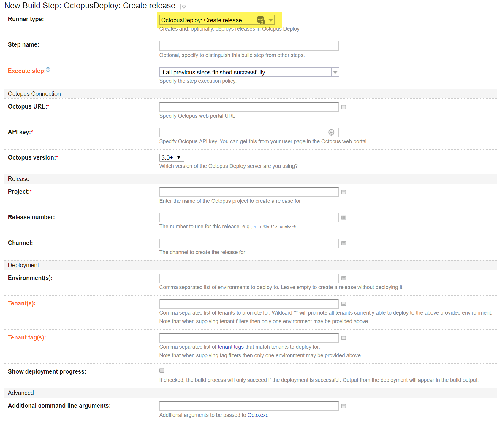
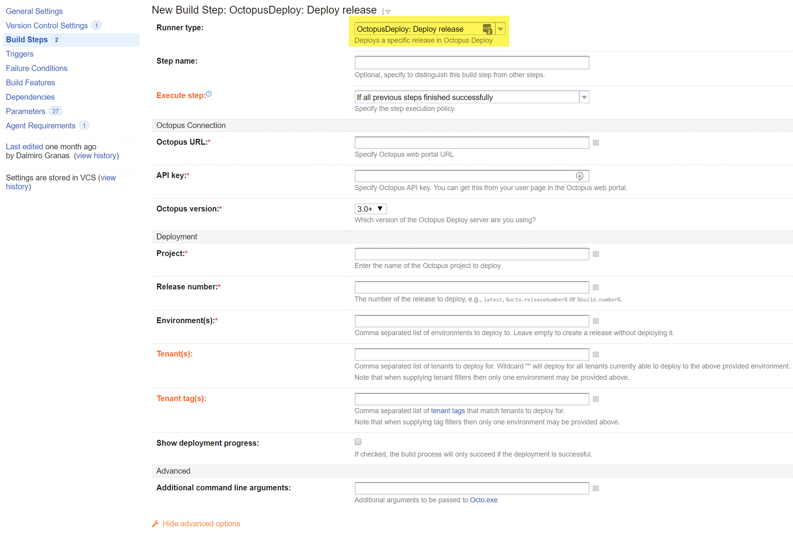
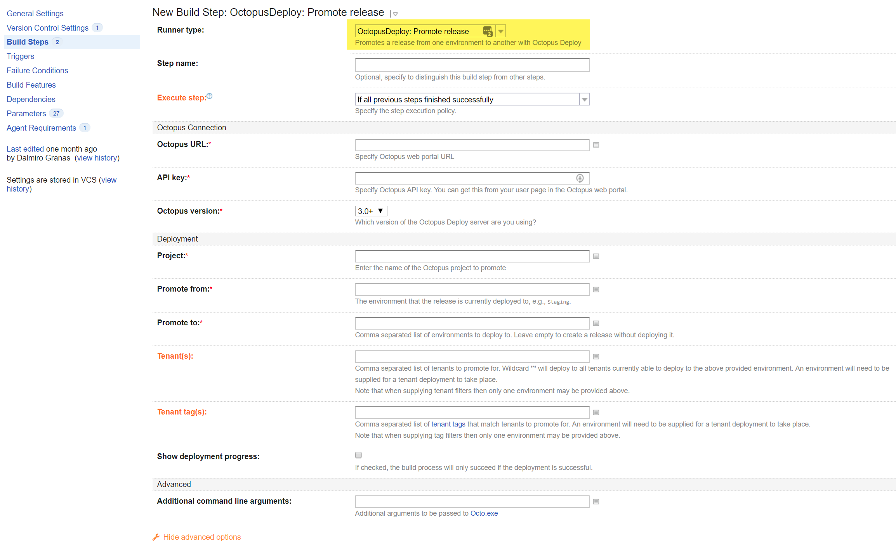
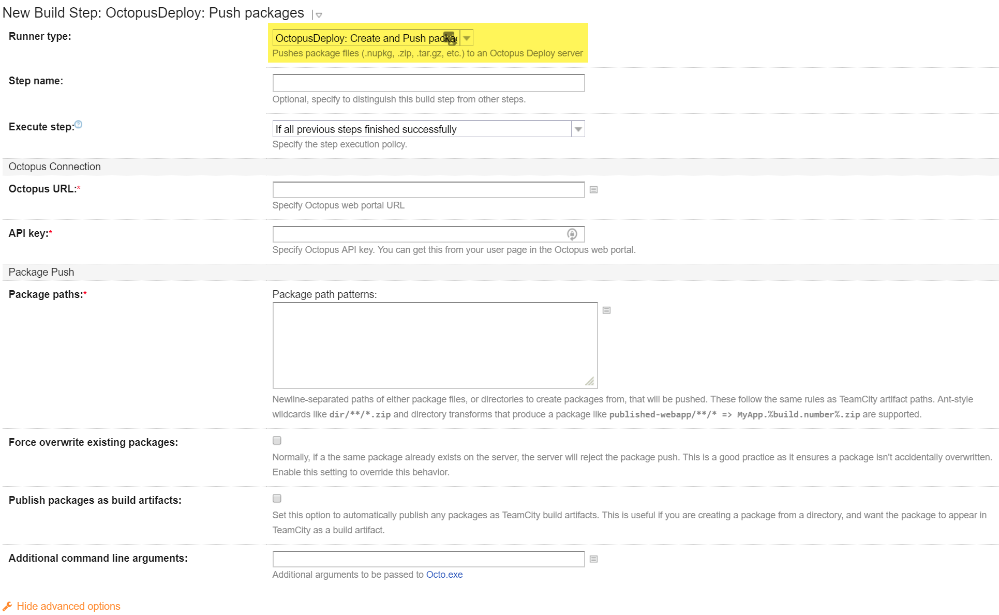

[TeamCity](http://www.jetbrains.com/teamcity/) from JetBrains is a popular continuous integration server that supports a variety of different version control systems and build runners. Octopus Deploy and TeamCity can work together to make automated, continuous delivery easy.

!toc

## How TeamCity and Octopus work together {#TeamCity-HowTCandOctopusWorkTogether}

When using Octopus Deploy with TeamCity, TeamCity will usually be responsible for:

Checking for changes in source control
Compiling the code
Running unit tests
Creating NuGet packages for deployment
While Octopus Deploy will be used to take those NuGet packages and to push them to development, test and production environments.

Integration with TeamCity involves two major parts:

1. Creating the NuGet packages from your applications.
2. Optionally, when a build completes, having TeamCity make requests to your Octopus Server to:

- Create releases
- Trigger deployments and/or
- Promote releases when a build completes

## Installing the plugin {#TeamCity-Installingtheplugin}

### Build agent running Windows

1. Download the [TeamCity Plugin ZIP file](https://octopus.com/downloads)
2. Shut down your TeamCity server
3. Copy the ZIP file with the plugin to `<TeamCity Data Directory>/plugins`
4. Start TeamCity server: the plugin files will be unpacked and processed automatically

The [TeamCity Data Directory](https://confluence.jetbrains.com/display/TCD10/TeamCity+Data+Directory) can be found on the **Administration | Global Settings** page for a running TeamCity server instance.

### Build agent running Linux {#TeamCity-LinuxAgentsUsingthepluginwithLinuxbuildagents}

Same instructions as for the Windows Agent, but additionally the build agent VM needs to meet the following requirements:

1. Have [.NET Core](https://www.microsoft.com/net/core) installed on the build agent and in the PATH such that the `dotnet` command runs successfully. To install, follow the linked guide to install the .NET Core SDK for your distribution. Ensure that the `dotnet` command runs successfully.
2. Have the Octo command line tool installed and in the PATH such that the `Octo` command runs successfully. To install, download the .tar.gz for you system from the [Octopus download page](https://octopus.com/downloads), extract somewhere appropriate and symlink `Octo` into your PATH. Again, ensure that `Octo` runs successfully. On Ubuntu you may need to install `libunwind8` using your package manager`.`

## Using the steps from the plugin

As explained in our [Troubleshooting guide](troubleshooting-integrations-with-build-servers.md#Octopus-Steps-What-happens-behind), each of the build runners provided by the plugin correspond to a specific `Octo.exe` command. While its not necesary to know each command to use these steps, It'll certainly if you ever need to [troubleshoot them](#TeamCity-TroubleshootingSteps).

### Creating a release in Octopus {#TeamCity-CreatingReleases}

To create releases from a build, use the `OctopusDeploy: Create Release` step. This step will execute [Octo.exe create-release](\octo.exe-command-line\creating-releases.md) in the background

**Tips about the step**:

- Be default this step will only create a release in Octopus, but it will not deploy it. If you want a deployment to happen right away (and avoid the need of a dedicated build step just for the deploy) simply fill the field `Deployment -> Environment(s)` with the name of the Environment you want to deploy this release to.

- If you want TeamCity to fail the build if the release creation/deployment fails in Octopus, make sure to check the box `Show Deployment Progress`.

### Triggering a deployment in Octopus {#TeamCity-TriggeringDeployments}

To trigger a deployment for an already existig releases, use the `OctopusDeploy: Deploy Release` step. This step will execute [Octo.exe Deploy-Release](\octo.exe-command-line\deploying-releases.md) in the background

### Promoting a release in Octopus {#TeamCity-TriggeringDeployments}

To promote a release from one environment to another in the same lifecycle, use the `OctopusDeploy: Promote Release` step. This step will execute [Octo.exe Promote-Release](\octo.exe-command-line\promoting-releases.md) in the background.

### Creating a package and pushing it to a repository {#TeamCity-CreatingAndPushingPackages}

**If you are using the Octopus built-in repository to store your packages (recommended)**

There are [several ways to create packages](\docs\packaging-applications\index.md) out of your compiled applications during a build. But if you are using TeamCity, we strongly recommend you to use the `OctopusDeploy: Create and Push Packages`. This step will execute [Octo.exe pack](\docs\packaging-applications\nuget-packages\using-octo.exe.md) and [Octo.exe push](\octo.exe-command-line\pushing-packages.md) in the background.

**Tips about the step**:

- This step will only pack the contents of the folder it is pointed to. So you need to make sure you understand how to control the output of your compiler in a way that (1) it only outputs the files you need to pack and deploy and (2) it sends these files to a fixed wolder where you'll be pointing this step to for packaging.

- The `Package Paths` field allows you to input multiple lines in case you want to pack multiple directories into different packages. Once all the packages are created, all of them will be pushed to the target repository.

**If you are using a 3rd party repository to store your packages**

WIP

## Consuming the TeamCity NuGet feed in Octopus {#TeamCity-UsingTeamCityAsAPackageFeed}

:::warning
**Compatibility**
**Octopus 2.x-3.3.x** will work with **TeamCity 7.0 or newer**.

**Octopus 3.4+** requires **TeamCity 9.0+** due to compatibility problems with the older NuGet v1 feed implemented by earlier versions of TeamCity. Refer to [this thread](http://help.octopusdeploy.com/discussions/problems/47581-teamcity-nuget-feed#comment_40952268) and this [GitHub Issue](https://github.com/OctopusDeploy/Issues/issues/2656) for more details.
:::

TeamCity 7 and up can act as a NuGet repository. You can enable this by going to the *Administration*&#10140;*NuGet Settings* page, and enabling the inbuilt NuGet server. Any build artifacts ending with `.nupkg` will automatically be served as NuGet packages, which Octopus can consume.

To connect Octopus to your TeamCity server, add the TeamCity authenticated feed URL to your NuGet settings in Octopus on the **External Feeds** tab under the **Library** page.

Once added, the TeamCity feed will appear in the NuGet feed list:

You can use the *Test* link (in the doted line menu at the right of the feed) to make sure that the NuGet package is available, before creating your Octopus project:

:::success
**Tip: delayed package publishing**
NuGet packages created from your build **won't appear in the TeamCity NuGet feed until after the build fully completes**. If you plan to trigger a deployment during a build, this creates a problem: the package won't be in the feed until the build is published, so you won't be able to deploy it.

The solution is to configure a secondary build configuration, and use a snapshot dependency and build trigger in TeamCity to run the deployment build configuration after the first build configuration completes. The video below demonstrates how to do this.
:::

## Troubleshooting issues with the plugin steps {#TeamCity-TroubleshootingSteps}

If you run into any issues with the steps provided by the plugin, please refer to our [troubleshooting guide for integrations between Octopus and build servers](troubleshooting-integrations-with-build-servers.md)