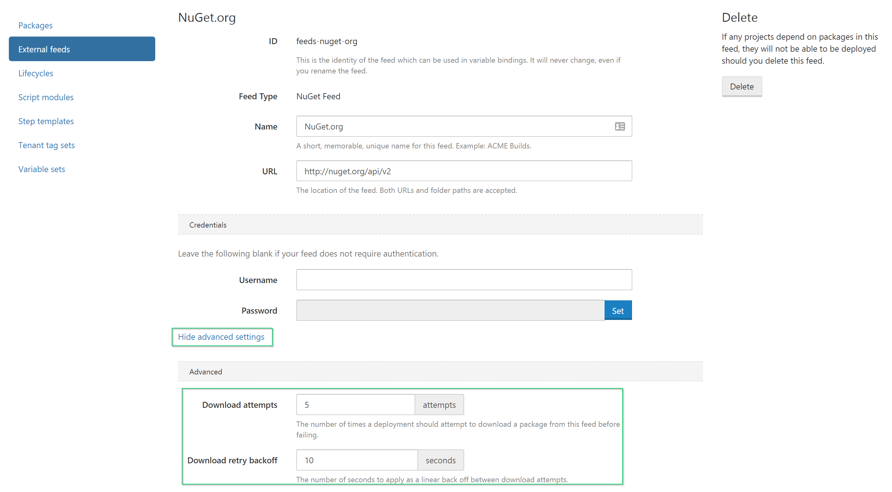

When deploying your project you may see a message like one of the following examples:

- The package could not be located in the built-in repository
- The package could not be downloaded from the external feed
- Unable to download package
- Failed to download package
- The package could not be downloaded from NuGet.
- Could not find package in feed

This troubleshooting guide will help you understand what is going wrong and how to avoid this problem in future deployments.

If this is part of an automated deployment, make sure all packages are pushed to the external feed before starting the deployment. If the packages are pushed, perhaps the external feed hasn't finished updating its index and you need to give the external feed more time to update its index before starting the deployment. If you are getting a package verification error, try switching to a Windows File Share package repository to see if that helps.

## Using the built-in repository {#Troubleshootmissingpackages-Usingthebuilt-inrepository}

If you are using the built-in repository, you may see a message like "The package could not be located in the built-in repository". These steps should help you diagnose the root cause of the problem and fix it:

Try manually deploying the same release again (in other words retry the exact same deployment)

- **If retrying the deployment fails** the most likely problems are the package wasn't pushed, or there is a mismatch in Package ID and/or Version somewhere.  
  - Make sure the correct package is [pushed to the built-in repository](/docs/packaging-applications/package-repositories/pushing-packages-to-the-built-in-repository.md) and try the deployment again.  
  - Double check the package version and any metadata match what you expect. The index for the built-in repository will use embedded package metadata in preference to the file name of the package when determining the Package ID and Version.  
- **If retrying the deployment succeeds** the most likely problem is that the package wasn't pushed to the built-in feed before the deployment started.  
  - The built-in feed has no indexing delay, packages are immediately available after being pushed.  
  - By default Octopus will attempt several times to locate the package in the built-in feed over a period of time, just in case.  
  - Make sure all packages required by the project are pushed to the built-in repository before starting the deployment of that project.  

:::hint
The built-in repository is a simple abstraction around the file system on your Octopus Server, with an index stored in the Octopus SQL Database. When you [push a package to the Octopus built-in repository](/docs/packaging-applications/package-repositories/pushing-packages-to-the-built-in-repository.md), it will be immediately added to the index and available for use in deployments: there is no delay. Octopus will also periodically scan the packages folder to make sure the index stored in the Octopus SQL Database is synchronized with the packages stored on the file system. If you manually add a package to the file system directly, there will be a delay until the package is added to the index.
:::

## Using an external feed {#Troubleshootmissingpackages-Usinganexternalfeed}

If you are using an external feed you may see a message explaining the package cannot be found or that it cannot be downloaded during the deployment. These steps should help you diagnose the root cause of the problem and fix it:

- Try manually deploying the same release again (in other words retry the exact same deployment)
  - **If retrying the deployment fails** the most likely problems are the package wasn't pushed, or there is a mismatch in Package ID and/or Version somewhere.
    - Make sure the package is pushed successfully to your external feed.
      - If the package exists in the external feed, check it hasn't been hidden/removed from the package feed's index. For example, in NuGet.org you cannot delete packages, you can only hide them from the index so it doesn't appear in search results.
      - Double check the package version and any metadata inside the package actually match what you expect. The index for your external feed will usually read the embedded package metadata in preference to the file name of the package when determining the Package ID and Version.
  - **If retrying the deployment succeeds** the most likely problem is that the external feed didn't index the package quickly enough after the package was pushed.
    - By default Octopus will attempt several times to download the package from your external feed over a period of time.
    - Try to improve the indexing performance of your external feed by cleaning up old packages. Most external feeds provide automatic retention policies to help keep your feeds clean.
    - Make sure all packages required by the project are pushed to the external feed before starting the deployment of that project.

### Configurable retries for external feeds {#ConfigurableRetriesForExternalFeeds}

Since Octopus 3.8.6 you can configure how tolerant Octopus will be when attempting to source a package from an external feed.

  