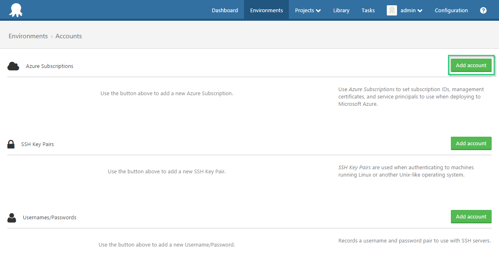
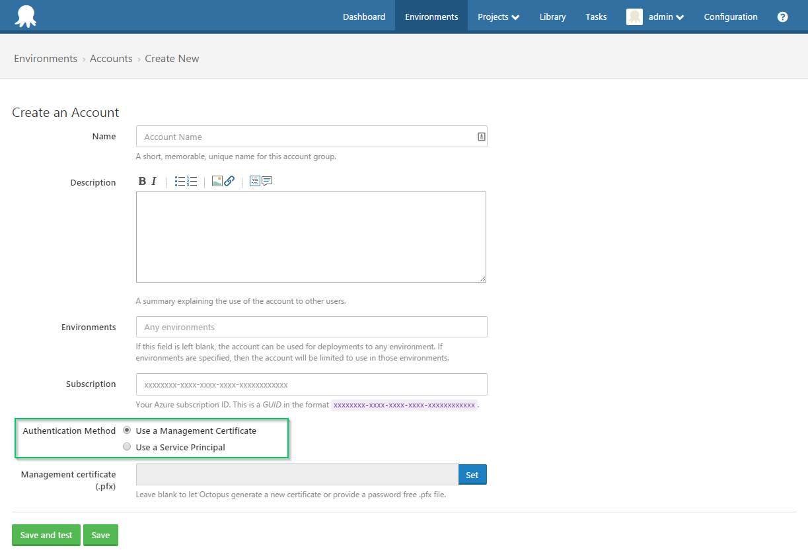

Navigate to {{Infrastructure,Accounts}} and click *Add account* in the *Azure Subscriptions* section.

On the Create New Account page, in the *Authentication Method* field select *Use a Service Principal*.

The values for the following fields come from Azure:

**Subscription ID**:  The ID of the Azure Subscription this account will interact with. In the Azure Portal, this can be found in the properties of the subscription. 

**AD Client\Application ID**:  This is the ID of the application in Azure Active Directory. It is known as ApplicationID in the PowerShell API, and in the new Azure Portal it can be found under the *App registrations* blade in the *Azure Active Directory*. In the old Azure Portal it may be listed as 'Client ID'.

**AD Tenant ID**: The ID of the Active Directory tenant. You can find this in the *Properties* blade of the *Azure Active Directory*, listed as 'Directory ID'.

**AD Password\Key**: The password for the Azure Active Directory application: this is know as 'Password' in the API or 'Key' in the Azure Portal. New keys can be generated in the portal under the *Keys* blade of the Azure Active Directory application.

Use the *Save and test* button to confirm the account can interact with Azure.

:::hint
**What is actually tested?**
When you click the Save and Test button, Octopus will attempt to use the account credentials to access the Azure Resource Management (ARM) API and list the Resource Groups in that subscription. You may need to whitelist the appropriate IP Addresses for the Azure Data Center you are targeting. See [deploying to Azure via a Firewall](/docs/deploying-applications/deploying-to-azure/index.md) for more details.
:::
